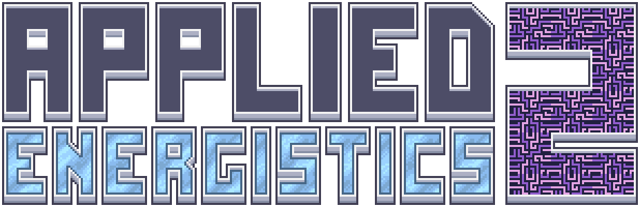

---
navigation:
  title: Applied Energistics 2
  icon: guidenh:guide
  position: 0
  recommend: 1
item_ids:
- guidenh:guide
---

# What is Applied Energistics 2?

Applied Energistics 2 adds components and mechanics to provide logistics and storage solutions. You can replace your
massive room full of chests with a compact ME Network, but that's just the beginning of things.
Applied Energistics is meant to work with and allow automation of other mods in a modpack. You can set up your system to,
with a single click, craft all of the prerequisites (and the final result) of a complex crafting chain, or keep certain
quantities of items in stock, crafting more as needed, or simply transfer items around your base.

* [Getting Started](getting-started.md)
* [AE2 Mechanics](ae2-mechanics-index.md)
* [Tips and Practical Examples](tricks-example-index.md)
* [Items & Blocks](items-blocks-index.md)

# How To Use This Guide

* Many pages have interactive scenes. If a scene has  and  zoom buttons beside it, you can move the camera around.
* Left-click and drag to rotate the scene. Right-click and drag to pan it.
* Hover over blocks or annotations to see their tooltips.

<GameScene zoom="4" interactive={true}>
  <ImportStructure src="assets/structures/autocraft_setup_greebles.snbt" />
  <IsometricCamera yaw="195" pitch="30" />
</GameScene>
